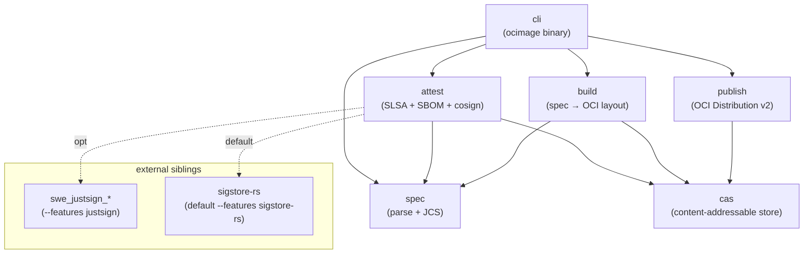
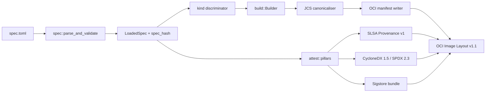
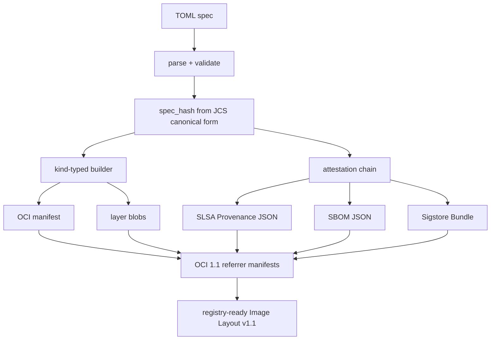

# Architecture

**Audience**: Architects, contributors

> **TLDR**: Five-crate pipeline — spec → build → attest → publish — wires through a shared CAS; hand-rolled OCI types and Distribution wire lock in reproducibility-critical serialisation and per-blob idempotence.

## Diagrams

The four diagrams below cover the four shapes of the system: which crates depend on which (inclusion), how the pieces wire up at runtime (block), how a build flows data end-to-end (data flow), and how a publish-then-verify call sequences across the registry boundary (sequence). The ASCII pipeline that follows the diagrams is the same picture in a different style — keep both because each catches a different category of confusion.

### Inclusion: workspace dep graph



### Block: runtime layout of `ocimage build`



### Data flow: TOML → registry-ready bundle



### Sequence: publish + verify across the registry boundary

```mermaid
sequenceDiagram
  participant Op as Operator (ocimage)
  participant Pub as publish::Sink
  participant Reg as OCI Registry
  participant Ver as Verifier
  participant Cosign as Sigstore Verifier

  Op->>Pub: ocimage publish dist/ --to registry:tag
  Pub->>Reg: PUT manifest + blobs
  Pub->>Reg: PUT referrer manifests (SLSA, SBOM, sig)
  Reg-->>Pub: digests
  Pub-->>Op: published refs

  Note over Op,Reg: time passes; another consumer pulls

  Ver->>Reg: GET manifest by digest
  Ver->>Reg: GET referrers (SLSA, SBOM, sig)
  Reg-->>Ver: blobs
  Ver->>Cosign: verify Sigstore Bundle (DSSE + Rekor proof)
  Cosign-->>Ver: ok / chain failure
  Ver-->>Op: pass/fail per policy.toml
```

## Pipeline (ASCII)

```
                       ┌──────────────────┐
                       │  spec.toml       │
                       └────────┬─────────┘
                                │
                                ▼
                       ┌──────────────────┐
                       │  spec crate      │
                       │  parse + validate│
                       │  + JCS canon-    │
                       │    icalise       │
                       └────────┬─────────┘
                                │ LoadedSpec, spec_hash
                                ▼
            ┌───────────────────┴───────────────────┐
            │                                       │
            ▼                                       ▼
    ┌──────────────┐                       ┌──────────────┐
    │ build crate  │                       │ attest crate │
    │ Spec → OCI   │                       │ SLSA + SBOM  │
    │ Layout v1.1  │                       │ + cosign     │
    └──────┬───────┘                       └──────┬───────┘
           │ BuildOutput                          │ AttestationOutputs
           │ (manifest, config,                   │ (slsa, sbom, sig)
           │  layer digests)                      │
           └──────────────┬───────────────────────┘
                          ▼
                  ┌──────────────┐         ┌──────────────┐
                  │ cli (build)  │ ──────▶ │ FsCas        │
                  │ wires output │         │ <output>/    │
                  │ + referrers  │         │  blobs/      │
                  └──────┬───────┘         └──────────────┘
                         │
                         │ OCI Image Layout v1.1
                         ▼
                  ┌──────────────┐
                  │ publish      │
                  │ HTTP / OCI   │
                  │ Distribution │
                  └──────────────┘
```

## Six crates, one CAS primitive

| Crate | Role | Public surface |
|-------|------|----------------|
| `spec` | Parse + validate TOML, canonicalise via JCS | `parse_and_validate`, `spec_hash`, `LoadedSpec` |
| `build` | `LoadedSpec` → OCI Image Layout v1.1 directory | `build(loaded, output_dir)` |
| `attest` | Three pillars (SLSA / SBOM / cosign+Rekor) | `attest(built, attestation, cas)` |
| `publish` | OCI Image Layout → HTTP or OCI Distribution sink | `publish(image, sink)` |
| `cli` | `ocimage` operator CLI | binary |
| `systemd` | Generate xkvm boot `.service` units (will move out) | `generate_unit` |

The seventh primitive is [`justcas`](https://github.com/sweengineeringlabs/justcas)
— the `Cas` trait + `FsCas` + `MemCas` (sibling repo).

## Data flow

### Build path

1. CLI: `parse_and_validate(spec.toml)` → `LoadedSpec`.
2. CLI: `spec_hash(&loaded.spec)` → `cas::Digest` (the build pin).
3. CLI: `build::build(&loaded, &output_dir)` →
   - Open `FsCas` rooted at `<output_dir>.partial`.
   - For each layer: open source / build deterministic tar →
     stream through optional compression encoder → CAS write
     (in 64 KiB chunks, no full-payload buffering).
   - Build OCI image config from `[config]` block, write to CAS.
   - Build OCI manifest pointing at config + layers, write to CAS.
   - Write `oci-layout` + `index.json`.
   - Atomic rename `<output_dir>.partial` → `<output_dir>`.
4. CLI: construct `attest::BuiltArtifact` from build's output +
   spec + spec_hash.
5. CLI: `attest::attest(&built, &spec.attestation, &cas)` →
   emit SLSA + SBOM + signature blobs to the CAS.
6. CLI: rewrite `index.json` (atomic via tempfile-then-rename) to
   reference the attestation referrer manifests.

The CAS is the single source of truth for all blobs — layers,
config, manifest, attestations all share `<output>/blobs/sha256/`.
This matches the OCI Distribution spec's blob layout, so the
output dir is directly serve-able as a Level-2 registry.

### Publish path

1. CLI: `oci_publish::ImageDir::open(<dir>)` — validates the OCI
   layout and classifies primary manifest vs referrers.
2. CLI: dispatch on sink:
   - `Http`: copy each blob to `<dest>/blobs/sha256/<hex>` with
     skip-if-exists. Write `index.json` LAST via tempfile-rename
     (atomicity contract).
   - `Registry`: per-blob HEAD-then-PUT. PUT manifest LAST after
     all other blobs confirmed-present.
3. Return `PublishOutcome` with digests pushed + skipped + bytes
   uploaded.

### Verify path

1. CLI: detect `<ref>` shape (path on disk vs registry ref).
2. If registry ref: `registry::pull_into_image_dir(ref, auth, tempdir)`
   — pull manifest + config + layers + referrers, hash on the fly,
   reject digest mismatches before writing.
3. `oci_publish::ImageDir::open(<local-or-tempdir>)` — validates
   layout + classifies referrers.
4. For each cosign signature referrer: `CosignVerifyInvoker`
   verifies the signature + Rekor entry.
5. For each SLSA / SBOM referrer: structural validation of the
   JSON.
6. If `--policy`: gate each pillar against the policy file.

## Where the seams are

- **`spec` ↔ `build`**: `LoadedSpec`. Build doesn't know about TOML.
- **`build` ↔ `attest`**: `BuiltArtifact` (manifest + config +
  layer digests + spec + spec_hash). Attest doesn't know about
  `Cargo.toml` of build.
- **`build` ↔ `publish`**: nothing. Publish only knows
  `ImageDir`s on disk.
- **`attest` ↔ `publish`**: nothing direct. Attestation outputs
  land in the same CAS that publish reads from.
- **All crates ↔ `cas`**: the `Cas` trait. Backend-generic.

This is the seam pattern that lets the v0.2 work happen
piece-by-piece without breaking the others.

## Why hand-rolled OCI structs

`build/src/api/oci_manifest.rs` defines the OCI Image Spec v1.1
manifest / config / index / descriptor types by hand, rather than
pulling in the `oci-spec` crate. Reasons:

1. **Reproducibility-critical serialisation order.** We need
   `BTreeMap`-backed annotations + `skip_serializing_if =
   "Option::is_none"` to emit stable bytes. Pulling `oci-spec`
   means trusting their serde derives match this requirement
   across versions.
2. **Tight surface.** OCI v1.1 manifest is ~6 fields. The whole
   file is ~150 LOC. Cheap to maintain.
3. **No transitive churn.** `oci-spec` pulls in indirect deps
   we don't otherwise need.

The trade is a small in-tree maintenance burden for full
control over the serialisation contract.

## Why hand-rolled OCI Distribution wire

`publish/src/core/registry_sink.rs` and `cli/src/registry/pull.rs`
both speak OCI Distribution v2 directly via `reqwest::blocking`,
rather than using `oci-distribution::Client`. Same reasons as
above plus:

- **Per-blob HEAD short-circuit.** `oci-distribution` doesn't
  expose this granularity, but it's the entire production
  guarantee §6 contract for idempotent re-publish.
- **Test determinism.** httpmock can drive the wire shape
  exactly; an opaque client would need behavioural tests against
  a real registry.
